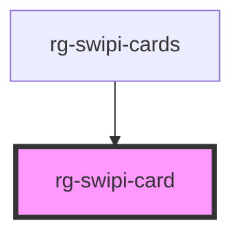

# rg-swipi-card

<!-- Auto Generated Below -->

## Properties

| Property     | Attribute     | Description | Type     | Default     |
| ------------ | ------------- | ----------- | -------- | ----------- |
| `leftColor`  | `left-color`  |             | `string` | `undefined` |
| `rightColor` | `right-color` |             | `string` | `undefined` |

## Events

| Event        | Description | Type               |
| ------------ | ----------- | ------------------ |
| `swipeleft`  |             | `CustomEvent<any>` |
| `swiperight` |             | `CustomEvent<any>` |

## Dependencies

### Used by

 - [rg-swipi-cards](../swipi-cards)

### Graph

----------------------------------------------

*Built with [StencilJS](https://stenciljs.com/)*
