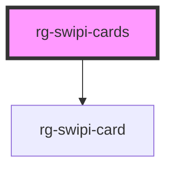

# rg-swipi-cards

<!-- Auto Generated Below -->

## Properties

| Property    | Attribute | Description | Type          | Default     |
| ----------- | --------- | ----------- | ------------- | ----------- |
| `cardStack` | --        |             | `SwipiCard[]` | `undefined` |

## Dependencies

### Depends on

- [rg-swipi-card](../swipi-card)

### Graph

----------------------------------------------

*Built with [StencilJS](https://stenciljs.com/)*
